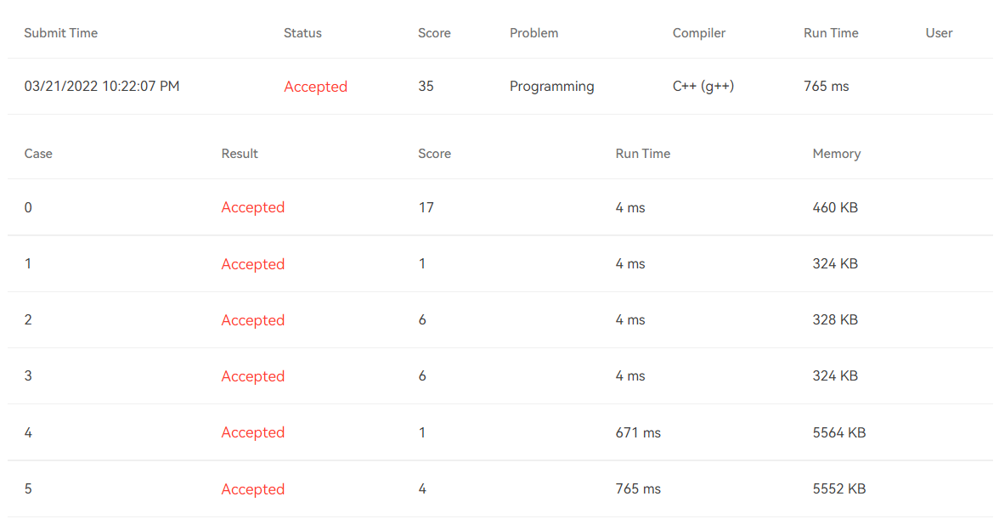

# [T1001](https://pintia.cn/problem-sets/994805148990160896/problems/994805156657348608) Battle Over Cities - Hard Version (35 point(s))

## 题干

It is vitally important to have all the cities connected by highways in a war. If a city is conquered by the enemy, all the highways from/toward that city will be closed. To keep the rest of the cities connected, we must repair some highways with the minimum cost. On the other hand, if losing a city will cost us too much to rebuild the connection, we must pay more attention to that city.

Given the map of cities which have all the destroyed and remaining highways marked, you are supposed to point out the city to which we must pay the most attention.

### Input Specification:

Each input file contains one test case. Each case starts with a line containing 2 numbers `N` (≤500), and `M`, which are the total number of cities, and the number of highways, respectively. Then `M` lines follow, each describes a highway by 4 integers: `City1 City2 Cost Status` where `City1` and `City2` are the numbers of the cities the highway connects (the cities are numbered from 1 to `N`), `Cost` is the effort taken to repair that highway if necessary, and `Status` is either 0, meaning that highway is destroyed, or 1, meaning that highway is in use.

Note: It is guaranteed that the whole country was connected before the war.

### Output Specification:

For each test case, just print in a line the city we must protest the most, that is, it will take us the maximum effort to rebuild the connection if that city is conquered by the enemy.

In case there is more than one city to be printed, output them in increasing order of the city numbers, separated by one space, but no extra space at the end of the line. In case there is no need to repair any highway at all, simply output 0.

### Sample Input 1:

```
4 5
1 2 1 1
1 3 1 1
2 3 1 0
2 4 1 1
3 4 1 0
```

### Sample Output 1:

```
1 2
```

### Sample Input 2:

```
4 5
1 2 1 1
1 3 1 1
2 3 1 0
2 4 1 1
3 4 2 1
```

### Sample Output 2:

```
0
```

## 题目大意

地图上有一些城市和一些道路，每条道路能连接两座城市。目前有一些道路可以正常通行，而有些被摧毁从而无法使用。如果某座城市被敌人占领，那么与此城市相连的道路将被全部关闭，且为了使剩下的城市保持连通，需要将某些被毁的道路重新修好(修路需要花费一定费用)。**另一方面**，如果某座城市被占领后需要花费很多费用修建被毁道路，那么这座城市**应当受到重点关注**。

现在问题来了：给定一张图上的所有城市和道路，判断出哪些城市应当受到最多的关注(被占领后修路费用最多)。

## 题目限制条件

- 时间限制：800ms
- 内存限制：64MB

## 本题考察知识点

- [无向图割点算法](https://blog.csdn.net/dx01259/article/details/79925063)
- [最小生成树算法](https://blog.csdn.net/luomingjun12315/article/details/47700237)
- [并查集](https://zhuanlan.zhihu.com/p/93647900/)

## 解题思路

遍历图中的每个点v，假设v被占领，用最小生成树算法计算此情况下将剩余点连通所需的费用。记录下费用最大的几个点并按题目要求升序输出即可。

需要注意的是**在测试点3中存在割点**。由于将割点删除后图的连通分量数为2(题目保证一开始图的连通分量数为1)，**如果割点被占领的话剩下的点无论如何也是不可能连通的**。因此获取输入后需要先判断图中是否存在割点，**如果存在割点就不用遍历每个点求构造最小生成树了，直接输出割点即可**。

## 提交结果



## 参考资料

https://blog.csdn.net/dx01259/article/details/79925063

https://blog.csdn.net/luomingjun12315/article/details/47700237

https://zhuanlan.zhihu.com/p/93647900/