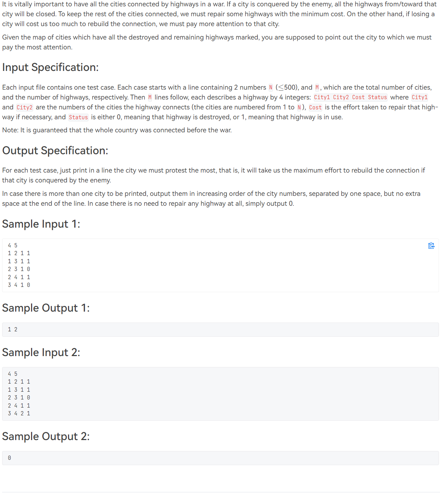

# [T1001](https://pintia.cn/problem-sets/994805148990160896/problems/994805156657348608) Battle Over Cities - Hard Version (35 分)

## 题干

## 题目限制条件

- 时间限制：800ms
- 内存限制：64MB

## 题目大意

地图上有一些城市和一些道路，每条道路能连接两座城市。目前有一些道路可以正常通行，而有些被摧毁从而无法使用。如果某座城市被敌人占领，那么与此城市相连的道路将被全部关闭，且为了使剩下的城市保持连通，需要将某些被毁的道路重新修好(需要花费一定费用)。**另一方面**，如果某座城市被占领后需要花费很多费用修建被毁道路，那么这座城市**应当受到重点关注**。

现在问题来了：给定一张图上的所有城市和道路，判断出哪些城市应当受到最多的关注(被占领后修路费用最多)。

## 本题考察知识点

- [无向图割点算法](https://blog.csdn.net/dx01259/article/details/79925063)
- [最小生成树算法](https://blog.csdn.net/luomingjun12315/article/details/47700237)
- [并查集](https://zhuanlan.zhihu.com/p/93647900/)

## 解题思路

遍历图中的每个点v，假设v被占领，用最小生成树算法计算此情况下将剩余点连通所需的费用。记录下费用最大的几个点并按题目要求升序输出即可。

需要注意的是**在测试点3中存在割点**。由于将割点删除后图的连通分量数为2(题目保证一开始图的连通分量数为1)，**如果割点被占领的话剩下的点无论如何也是不可能连通的**。因此获取输入后需要先判断图中是否存在割点，**如果存在割点就不用遍历每个点求构造最小生成树了，直接输出割点即可**。

## 提交结果

## 参考资料

https://blog.csdn.net/dx01259/article/details/79925063

https://blog.csdn.net/luomingjun12315/article/details/47700237

https://zhuanlan.zhihu.com/p/93647900/