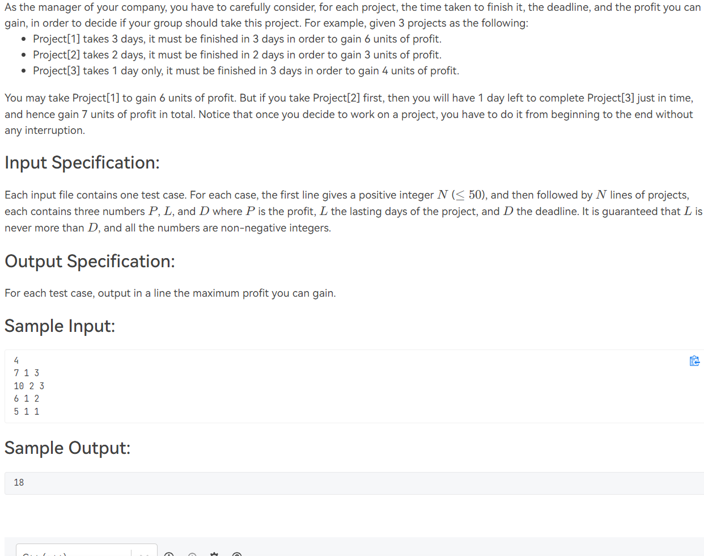
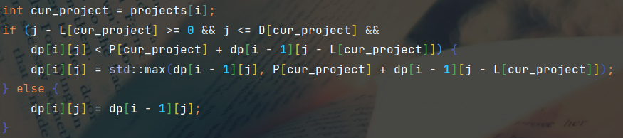
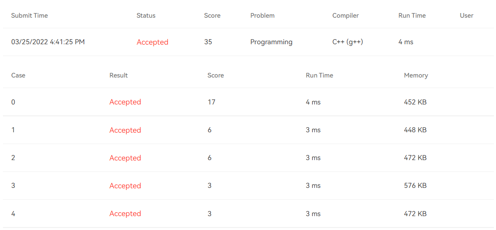

# [T1002](https://pintia.cn/problem-sets/994805148990160896/problems/994805156145643520) Business (35 分)

## 题干

## 题目限制条件

- 时间限制：800ms
- 内存限制：64MB

## 题目大意

现有N个工程，完成每个工程需要花费一定的时间，且能获得一定的利润。但每个工程有最后的完成截止日期(deadline)，超过deadline才完成的工程直接作废，不能获得利润，且**每个工程不能半途而废**。现在需要对工程的完成顺序作一些安排，使得获得的利润最大，并输出最大的利润。

## 本题考察知识点

- 动态规划(**D**ynamic **P**rocessing, **DP**)

## 解题思路

本题是背包问题的变体。其与背包问题的不同之处是：每个物品必须在规定的时间内被选择装入背包，在本题中就是指每个工程必须在特定的时间段内才有可能竣工。因此输入读取结束后首先应当将所有工程按照竣工日期升序排序。然后将本问题抽象化为背包问题求解。

设dp[i][j]表示距离开始工作过去了j天，且安排了前i个工程时获得的最大利润。则递推方程可以写成如下形式的C++代码：

## 提交结果

## 参考资料

https://blog.csdn.net/qq_41562704/article/details/100826468