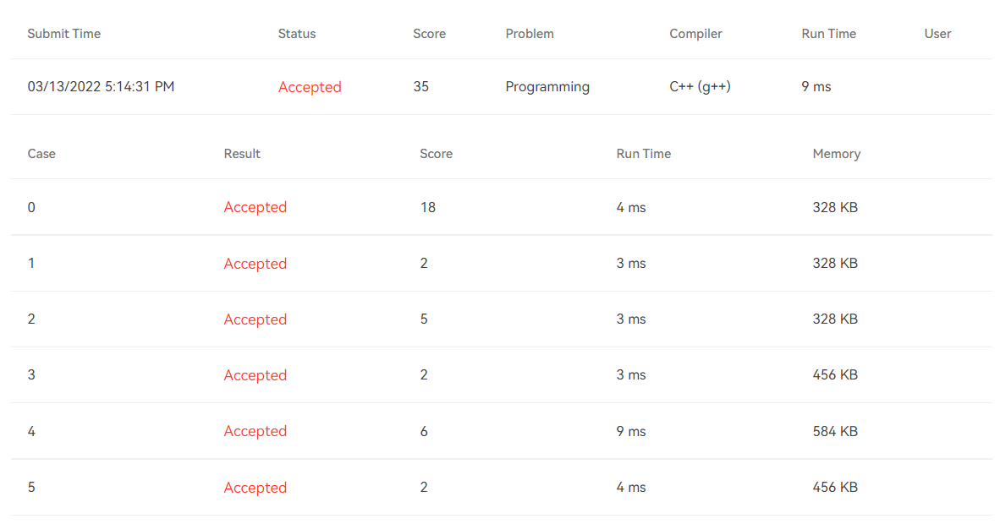

# [T1013](https://pintia.cn/problem-sets/994805148990160896/problems/994805151670321152) Image Segmentation (35 point(s))

## 题干

Image segmentation is usually formulated as a graph partition problem, where each segment corresponds to a connected component. Moreover, each pixel is the vertex of the graph. Each edge has a weight, which is a non-negative dissimilarity between neighboring pixels. So, the goal of image segmentation is to decompose the image graph into several disconnected components, where the elements in a component are similar and the elements in the different components are dissimilar.

The components are defined as follows:

- A component is made of a set of connected vertices;
- Any two components have no shared vertices;
- The dissimilarity *D*(*C*1,*C*2) of any two components *C*1 and *C*2 is larger than the confidence *H* of any of *C*1 and *C*2.
- The dissimilarity *D*(*C*1,*C*2) is defined to be the minimum edge weight of all the edges connecting *C*1 and *C*2, or infinity if no such edge exists;
- The confidence of a component *C*, *H*(*C*), is defined to be the maximum edge weight of the minimum spanning tree of *C*, plus a function *f*(*C*)=*c*/∣*C*∣ where *c* is a positive constant and ∣*C*∣ is the size of the component *C*;
- A set of vertices must not be treated as a component if they can be partitioned into two or more components.

Your job is to write a program to list all the components.

### Input Specification:

Each input file contains one test case. For each case, the first line contains three integers: *N**v* (0<*N**v*≤1000), the total number of vertices (and hence the vertices are numbered from 0 to *N**v*−1); *N**e*, the total number of edges; and *c*, the constant in the function *f*(*C*). Then *N**e* lines follow, each gives an adge in the format:

```
V1 V2 Weight
```

Note: it is guaranteed that each pixel has no more than 8 neighboring pixels. The constant and all the weights are positive and are no more than 1000.

### Output Specification:

For each case, list each component in a line. The vertices in a component must be printed in increasing order, separated by one space with no extra space at the beginning or the end of the line. The components must be listed in increasing order of their first vertex.

### Sample Input 1:

```in
10 21 100
0 1 10
0 3 60
0 4 90
1 2 90
1 3 50
1 4 200
1 5 86
2 4 95
2 5 5
3 4 95
3 6 15
3 7 101
4 5 500
4 6 100
4 7 101
4 8 101
5 7 300
5 8 50
6 7 90
7 8 84
7 9 34
```

### Sample Output 1:

```out
0 1 3 6
2 5 8
4
7 9
```

### Sample Input 2:

```in
7 7 100
0 1 10
1 2 61
2 3 50
3 4 200
4 5 82
5 0 200
3 6 90
```

### Sample Output 2:

```out
0 1
2 3 6
4 5
```

## 题目大意

给定一个无向图，要求把图中的这些点划分成为若干个彼此不重叠的连通块(component)。划分要求见题干。

## 题目限制条件

- 时间限制：200ms
- 内存限制：64MB

## 本题考察知识点

- [kruskal算法](https://blog.csdn.net/luomingjun12315/article/details/47700237)
- [并查集](https://zhuanlan.zhihu.com/p/93647900/)

## 解题思路

此题所用算法是kruskal算法的变体。在使用kruskal算法构造最小生成树(Minimum Spanning Tree, **MST**)时，能将某条边的两个点合并至同一集合的充要条件是此两点属于不同的集合。而此题的解法只是在原生kruskal算法的基础上多加了一个限制条件：设u,v是在kruskal算法执行过程中当前边e的两个顶点。则将u和v合并至同一集合的条件是：

1. u和v属于不同的集合。
2. D(C1,C2)<=H(C1) \&\& D(C1,C2)<=H(C2)，其中C1,C2分别是u,v所在的连通块。$D,H的含义见题干。

由H的含义可知，计算H需要先知道连通块中点的个数及其MST中最大权重边上的权重。题目给出的时间限制是200ms，如果针对每个连通块都计算统计一遍点个数并求一遍最小生成树，则必然会超时。**因此要另外开辟数组动态地维护每个点所在连通块中的点个数及其MST中最大权重边上的权重。**

## 提交结果



## 参考资料

https://blog.csdn.net/qq_41562704/article/details/104154689

https://blog.csdn.net/ylwhxht/article/details/119525524