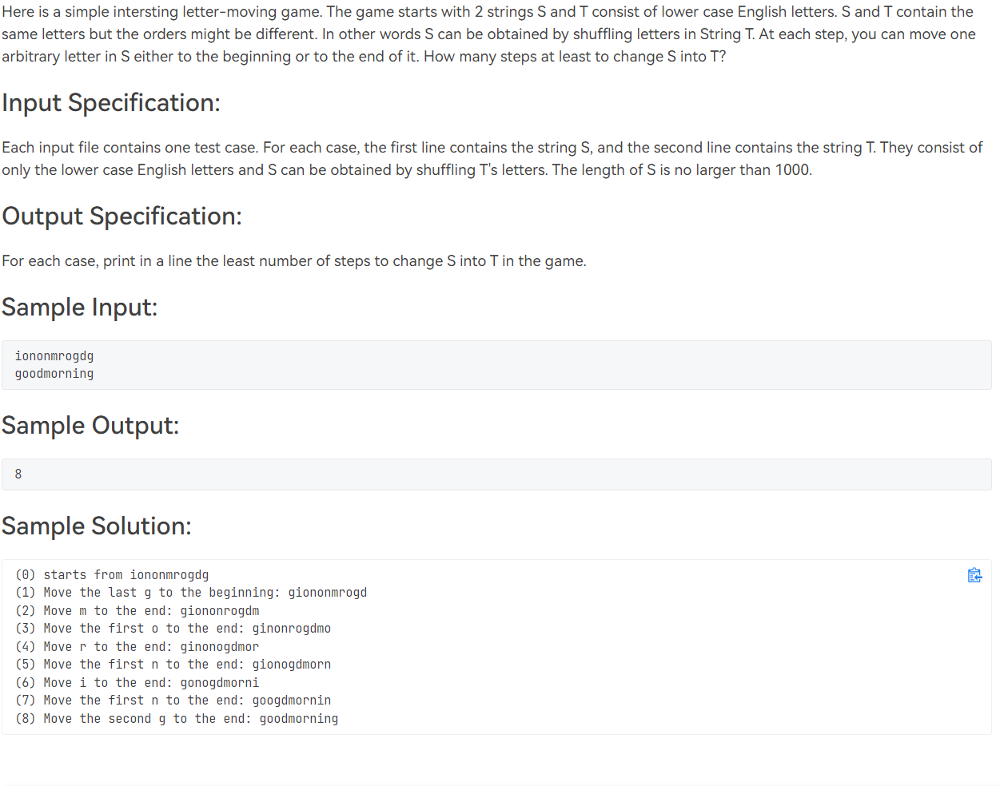
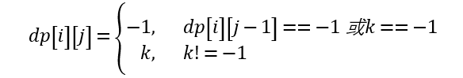
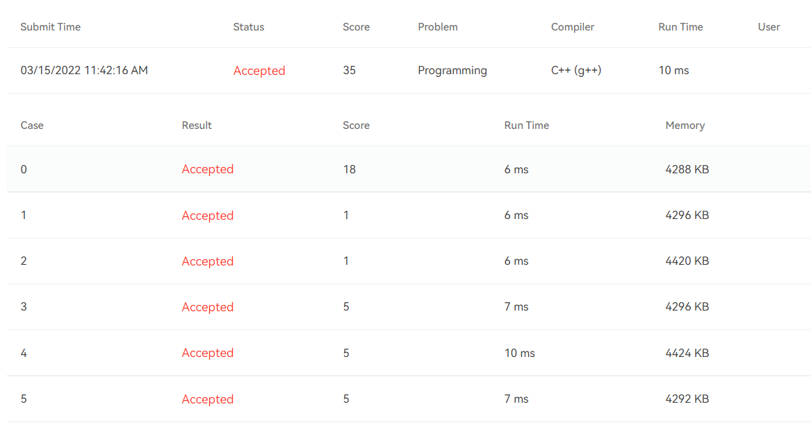

# [T1015](https://pintia.cn/problem-sets/994805148990160896/problems/994805151045369856) **Letter-moving Game (35 分)**

## 题干

## 题目限制条件

- 时间限制：200ms
- 内存限制：64MB

## 题目大意

输入两个仅由小写字母构成的字符串S,T，且题目保证S恰好是将T中的字母随机打乱得到的。现在问题来了：如果我们每次操作能够将S中的一个字母移动到S的**开头**或**末尾**，那么字符串S最少经过多少次可以被还原为T？

## 本题考察知识点

动态规划(**D**ynamic **P**rocessing, **DP**)

## 解题思路

本题的运行时间限制较为严格，所以肯定是不能暴力破解的，必须用一些巧妙的方法来解题。说到巧妙，DP可以算是技巧性较强的一种编程思想了，而且跟字符串有关的题又很喜欢考DP，所以自然而然地想到尝试用DP来做题。但是DP的技巧性强就强在它没有固定的思路或写法，很难通过专门练习DP题目在短时间内速成。

进入正题。我们观察到第一步将S中的第一个"g"移动到了开头。在此我们应当先思考三个问题：

- 移动这个"g"对最终的结果有什么影响？事实上，我们可以看到，在移动之前，S中出现了T的子串"ood"的子序列"i**o**n**o**nmrog**d**g"；经过这一步移动之后，S中出现了单词"good"的子序列"**g**i**o**n**o**nmrog**d**"。而后续的每次移动均能增加这样的子序列的长度，使所有字母“越来越紧凑”。

- 为什么移动第一个"g"而不是第二个"g"？事实上，第一步移动第二个"g"并不会对最终的结果产生任何影响。因为在后续移动的过程中，肯定有一次移动是将另外一个没有移动过的"g"移动到末尾。
- 为什么要移动8次？因为在移动之前，T中存在长度为3的子串"ood"，它也恰好是S的子序列。随后的每一次移动都会增加这个子序列的长度，直到子序列的长度等于T的长度，此时S和T相等。

综上，我们已经有了初步的思路。我们需要统计符合以下要求的字符串T'的最大长度：

- T'是T的子串
- T'是S的子序列

因此我们可以搜索T的所有子串，针对每个子串判断一下它是否是S的子序列。假设dp[i][j]是字符串T中从下标i开始长度为j的子串作为S的子序列在S中的结束位置(如果不是S的子序列则值为-1)，则可构造如下的状态转移方程：

其中k是从位置dp[i][j-1]+1开始往后数，字符T[i+j-1]第一次出现的位置(如果没有出现则值为-1)。

在计算dp数组的所有可能值的同时，记录下我们在计算过程中遇到过的最大的k。最后用k减去原字符串S的长度，就得到题目所要求的结果。

本题我花了灰常长的时间才做出来，虽然没有参考任何资料，但考场上真碰到这题我就直接寄了。不过比较欣慰的是一遍AC，没有在此纠结太久。

## 提交结果

