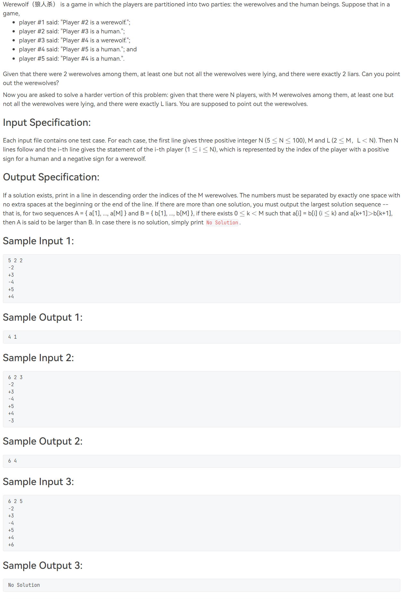
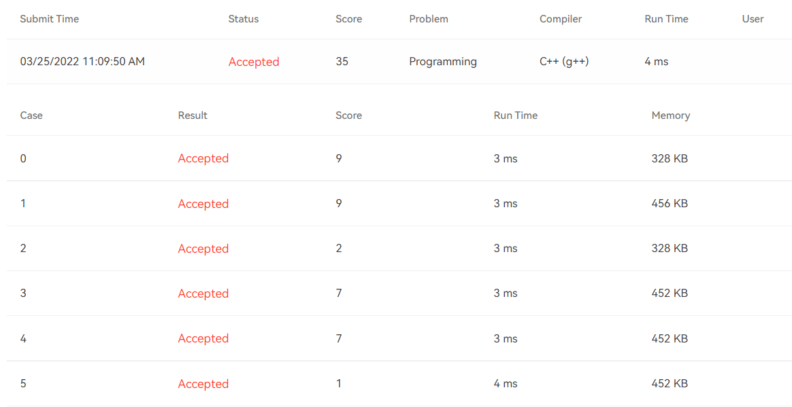

# [T1022](https://pintia.cn/problem-sets/994805148990160896/problems/994805149279567872) Werewolf (35 分)

## 题干

## 题目限制条件

- 时间限制：100ms
- 内存限制：64MB

## 题目大意

N名玩家坐在一起玩狼人杀(编号为1到N)，其中有M人是狼人。现在给出某一轮各玩家的发言，每名玩家都会声称在场某玩家的身份是好人(**用"+"表示**)或狼人(**用"-"表示**)。已知此轮发言中恰好有L人说谎(其发言与事实不符)，且**至少有一名狼人说谎但并非所有狼人都说谎**。请判断哪些玩家是狼人，降序输出他们的编号。**如果有多解，输出最大序列解；如果无解，输出No Solution**。

## 本题考察知识点

- 深度优先搜索(**D**epth **F**irst **S**earch, **DFS**)

## 解题思路

本题与 [A1148](https://pintia.cn/problem-sets/994805342720868352/problems/1038429808099098624) 如出一辙，只是要考虑的因素变多了：多了**狼人数**和**说谎人数**这两个参数。但这两题的思路都是一样的：DFS列举所有可能的狼人组合，然后分别判断每个组合的合法性(是否符合题目要求)。

判断合法性的过程如下：

1. 遍历一遍所有人说过的话，并根据目前的狼人组合筛选出说谎的玩家。
2. 判断说谎玩家数量是否为L。
3. 判断说谎的狼人数量是否在[1,M)范围内。

由于题目要求**输出最大序列解**，所以直接从编号最大的玩家处开始搜索。也就是说，如果有5名玩家，且其中有3名狼人的话，那么应该假设狼人组合为(5,4,3),(5,4,2),(5,4,1),(5,3,2),(5,3,1)...，按照这样的方式进行搜索。一旦搜索到合法解就结束算法。

## 提交结果

## 参考资料

https://blog.csdn.net/Bendaai/article/details/79967630
